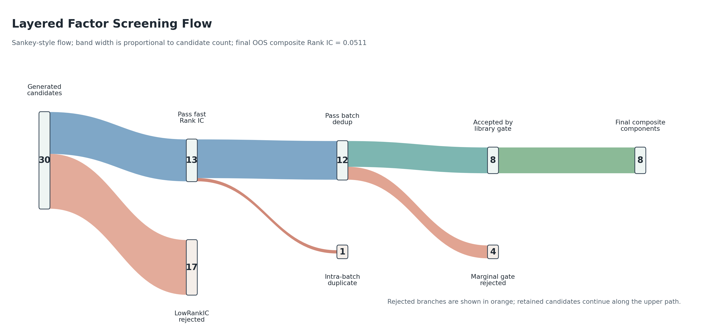
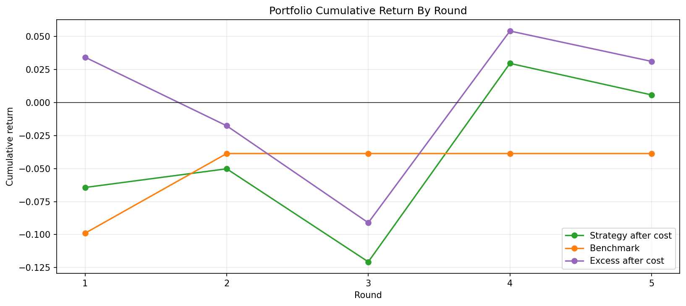
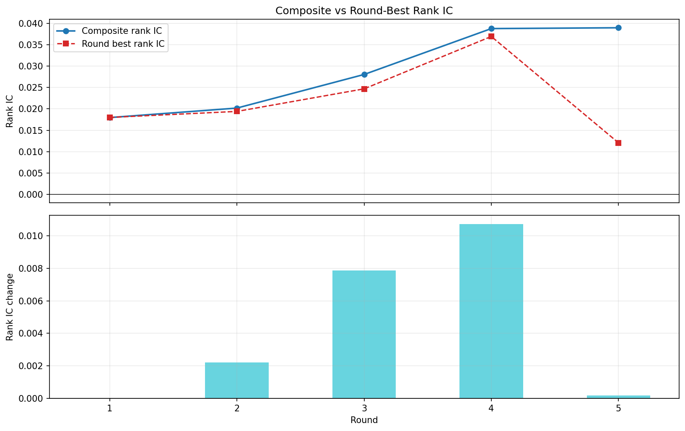
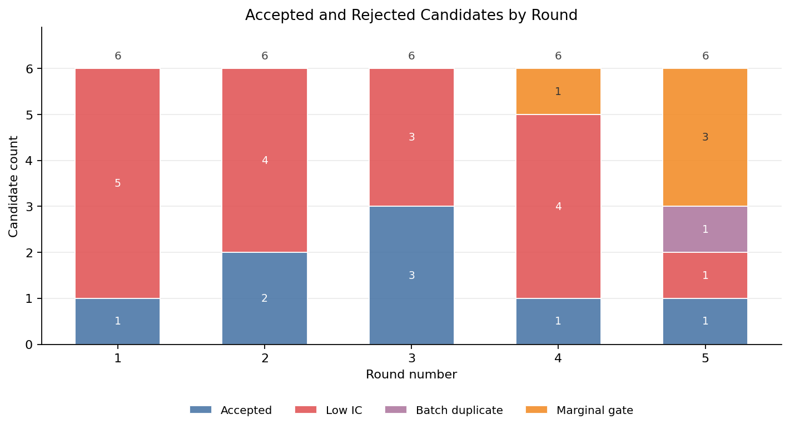

# Goldmine

Goldmine is an RLM-driven, language-model-in-the-loop factor-mining research pipeline for building and evaluating quantitative factor libraries on top of Qlib-style market data. It asks language-model candidates to write only the body of a `BaseSignal.compute()` method, evaluates the generated signal through this repository's quickbacktest / Qlib-adapter path, admits factors that pass configured validation and duplicate-control gates, and can evaluate the resulting composite factor both in sample and out of sample.

The current focus is **parallel reflexion factor mining**: each round generates multiple candidate factors, screens them by Rank IC, removes near-duplicates, applies a marginal contribution gate against the factor-library composite, and writes compact reflexion memory to guide later rounds.

## Features

- Parallel candidate generation with `ProcessPoolExecutor`.
- Constrained generated-factor contract: candidates submit only `compute()` body code.
- Deterministic validation outside the RLM loop with materialized `factor_data.csv` and `analysis.json`.
- Fast Rank IC screening, intra-batch Spearman deduplication, and factor-library correlation checks.
- Marginal contribution admission gate against the current composite factor.
- IC-weighted factor-library composite construction.
- Per-round portfolio history and final out-of-sample composite backtest.
- Reflexion memory over accepted patterns, failed directions, recent admissions, and IC history.

## Repository Layout

```text
.
|-- factor_miner.py                         # Compatibility CLI/import wrapper
|-- factor_miner_parallel_reflexion.py      # Parallel reflexion CLI wrapper
|-- src/
|   |-- factor_miner/                       # Single-factor miner implementation
|   |   |-- core.py
|   |   |-- __init__.py
|   |   `-- __main__.py
|   `-- factor_miner_parallel_reflexion/    # Parallel reflexion pipeline
|-- quickbacktest/                          # Signal, Qlib adapter, review, portfolio tools
|-- scripts/                                # Plotting and utility scripts
|-- runs/                                   # Local run outputs, ignored by git
`-- rlm_factor_memory.py                    # Reflexion memory manager
```

## System Structure

```text
RLM candidate processes
  -> submit_compute(compute_code)
  -> src.factor_miner.core
       wraps compute body, writes signal code, initializes Qlib,
       materializes factor_data.csv, and runs IC analysis
  -> src.factor_miner_parallel_reflexion.evaluation
       labels candidates, applies fast IC screen, and removes duplicates
  -> src.factor_miner_parallel_reflexion.library
       runs deterministic review, correlation checks, replacement checks,
       and marginal contribution admission
  -> src.factor_miner_parallel_reflexion.portfolio
       builds IC-weighted composite factors, portfolio history, and final OOS
  -> src.factor_miner_parallel_reflexion.reflexion + rlm_factor_memory.py
       updates state, accepted patterns, failed directions, and insights
```

| Layer | Main Files | Responsibility |
| --- | --- | --- |
| Single-factor runtime | `src/factor_miner/core.py` | Generated signal contract, `submit_compute`, final-answer validation, Qlib setup, IC analysis, and compatibility CLI. |
| Candidate generation | `candidate.py`, `branches.py`, `scheduler.py` | Builds prompts, assigns research branches, schedules novelty/mutation jobs, and runs candidates in parallel. |
| Evaluation | `evaluation.py`, `utils.py` | Extracts Rank IC, labels candidates, writes candidate results, and performs intra-batch deduplication. |
| Library admission | `library.py` | Applies deterministic metric review, factor-library correlation checks, replacement logic, and marginal contribution gating. |
| Portfolio and OOS | `portfolio.py` | Builds IC-weighted composite factors, runs portfolio tests, records history, and performs final OOS evaluation. |
| Memory and reflexion | `reflexion.py`, `memory.py`, `rlm_factor_memory.py` | Maintains state, accepted patterns, forbidden directions, insights, and round reflexion artifacts. |

## Entry Points

| Command | Purpose |
| --- | --- |
| `python -B factor_miner.py --help` | Single-factor mining CLI, kept as a stable compatibility entry point. |
| `python -B -m src.factor_miner --help` | Package-native single-factor mining CLI. |
| `python -B factor_miner_parallel_reflexion.py --help` | Main parallel reflexion factor-mining CLI. |
| `python -B -m src.factor_miner_parallel_reflexion.demo --help` | No-LLM demo that exercises assignment, evaluation, admission, memory, and artifacts. |

## How It Works

1. Build candidate jobs for the current round using the scheduler, research branches, existing factor library, and reflexion memory.
2. Ask each RLM candidate to submit a compact `compute()` body through `submit_compute(compute_code)`.
3. Wrap the body into a valid `BaseSignal`, compute factor data, and run IC analysis.
4. Reject invalid, low-IC, or duplicate candidates before library admission.
5. Admit candidates only if deterministic review, correlation checks, and marginal contribution checks pass.
6. Rebuild the IC-weighted factor-library composite after each round.
7. Save portfolio history, reflexion artifacts, memory, and a final `summary.json`.
8. Run a final OOS composite test unless `--skip-oos-test` is passed.

## Quick Start

This repository currently does not ship a package manifest, so prepare a Python environment with the dependencies used by `quickbacktest`, Qlib, pandas, NumPy, matplotlib, and pytest. The pipeline expects local Qlib data under `.qlib/qlib_data/cn_data` by default, or a custom path through `--provider-uri`.

Run a deterministic no-LLM smoke demo:

```powershell
python -B -m src.factor_miner_parallel_reflexion.demo `
  --output-dir .\runs\demo_parallel_reflexion
```

Run the parallel reflexion miner:

```powershell
python -B .\factor_miner_parallel_reflexion.py `
  --output-dir .\runs\my_parallel_reflexion_run `
  --start 2023-01-01 `
  --end 2024-12-31 `
  --oos-start 2025-01-01 `
  --oos-end 2026-01-31 `
  --rounds 5 `
  --candidates 6 `
  --run-portfolio `
  --marginal-contribution-min-delta -0.01
```

Reusing the same `--output-dir` resumes from its `memory.json`. Use a fresh output directory for a clean experiment.

## Example Results

The metrics below come from a local example run generated under the ignored `runs/` directory:

```text
runs/rlm_reflexion_marginal_test_5_2023-2025/
```

The full run directory is intentionally not versioned because `.gitignore` excludes `runs/`. Selected figures used by this README are copied to `docs/assets/example_run/` so the repository README renders on GitHub: factor filtering is shown as a Sankey-style flow, return and Rank IC are shown as curves, and screening reasons are shown as bars. This run used 5 rounds and 6 candidates per round over a 2023-2024 training window, then evaluated the final composite out of sample on 2025 data. The numbers below describe one archived experiment, not a benchmark or expected live performance.

| Metric | Value |
| --- | ---: |
| Generated candidates | 30 |
| LowRankIC rejections | 17 |
| Intra-batch duplicates removed | 1 |
| Library admission attempts | 12 |
| Marginal gate rejections | 4 |
| Accepted factors | 8 |
| Final OOS composite Rank IC | 0.0511 |
| OOS cumulative return after cost | 35.70% |
| OOS benchmark cumulative return | 26.37% |
| OOS excess return after cost | 5.28% |
| OOS annualized return after cost | 35.85% |
| OOS information ratio after cost | 2.29 |
| OOS max drawdown after cost | -8.39% |

### Layered Filtering Flow



### Round Progress

| Round | Best Candidate Rank IC | Composite Rank IC | Accepted Factors |
| ---: | ---: | ---: | ---: |
| 1 | 0.0180 | 0.0180 | 1 |
| 2 | 0.0194 | 0.0202 | 2 |
| 3 | 0.0247 | 0.0280 | 3 |
| 4 | 0.0369 | 0.0388 | 1 |
| 5 | 0.0121 | 0.0390 | 1 |

### Return and Rank IC Curves





### Screening Reasons

Candidate rejection and pass counts are shown as bars because this is a categorical breakdown by round.



## Output Artifacts

A full run writes self-contained artifacts under its output directory:

| Artifact | Description |
| --- | --- |
| `summary.json` | Full run summary, final OOS metrics, round results, memory snapshot, and artifact paths. |
| `memory.json` | Reflexion memory used to schedule and prompt later candidates. |
| `portfolio_history.json` / `portfolio_history.csv` | Per-round factor-library composite history. |
| `factor_library/` | Accepted factor source, cards, metrics, reviews, and factor data. |
| `round_XXX/` | Candidate workspaces, trajectories, economic context, reflexion output, and admission logs. |
| `fig_*.png` | Summary plots for inspection and reporting. |

## Development

Run the focused regression tests for the migrated factor-miner entry points:

```powershell
python -B -m pytest quickbacktest\tests\test_factor_miner_save_signal.py quickbacktest\tests\test_factor_miner_factor_library.py
python -B -m pytest quickbacktest\tests\test_parallel_reflexion_runner.py::test_package_top_level_main_remains_available
```

The top-level `factor_miner.py` is intentionally retained as a compatibility alias for `src.factor_miner.core`, so existing scripts and tests that monkeypatch `factor_miner` continue to patch the implementation module.

## Notes

This repository is a research system, not an investment product or trading recommendation. Results depend on the local data snapshot, model provider, candidate randomness, Qlib configuration, portfolio assumptions, and transaction-cost settings. Treat example metrics as a workflow smoke test before running broader robustness checks.