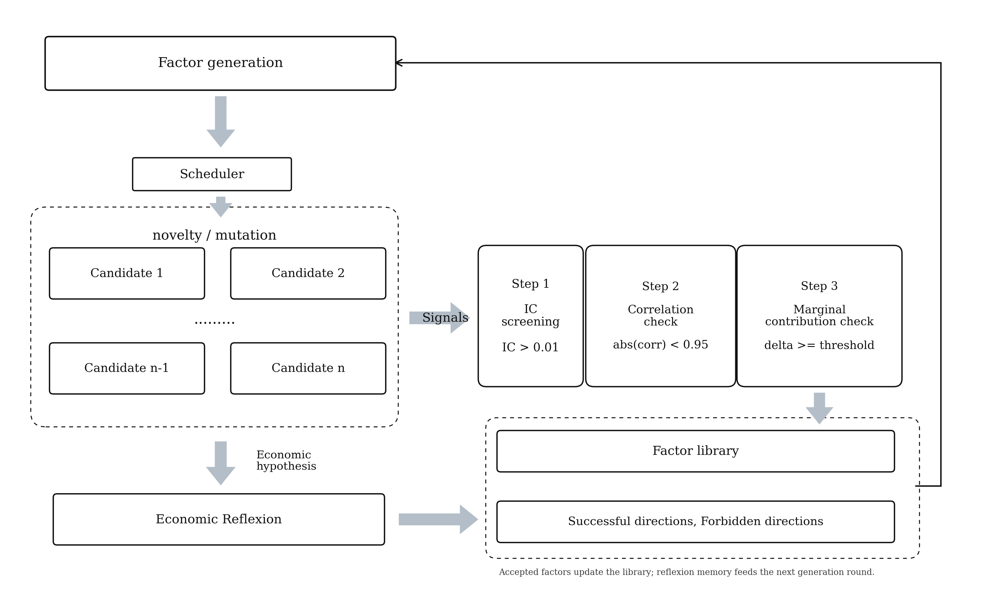
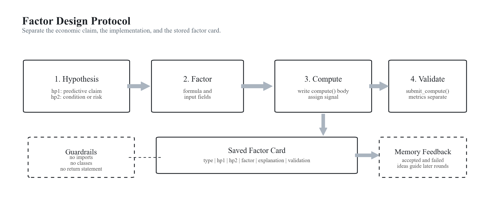
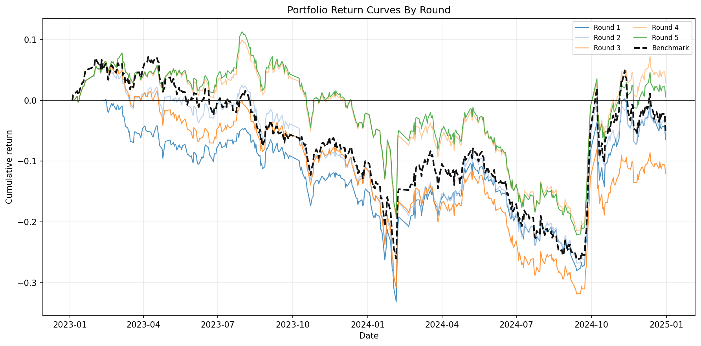
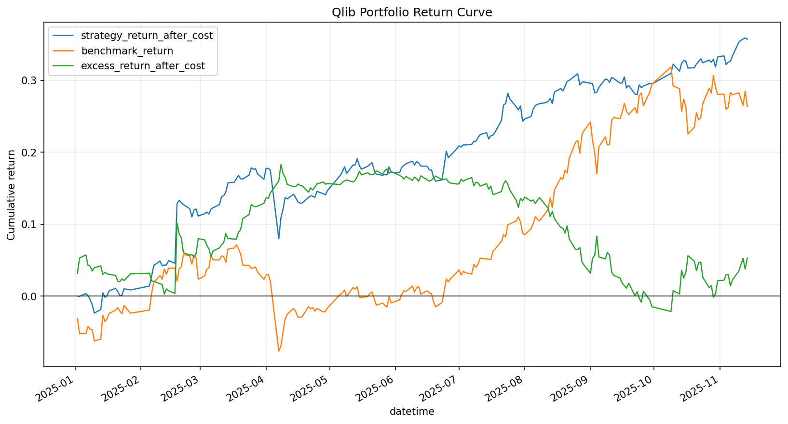

# Goldmine

Goldmine is an RLM-driven, language-model-in-the-loop factor-mining research pipeline for building and evaluating quantitative factor libraries on top of Qlib-style market data. Candidates write only the body of a `BaseSignal.compute()` method; the repository then evaluates the generated signal through its quickbacktest / Qlib-adapter path, applies duplicate and admission gates, and can test an IC-weighted composite both in sample and out of sample.

The current focus is parallel reflexion factor mining: multiple candidates are generated per round, screened by Rank IC, deduplicated, checked for marginal contribution, and summarized into reflexion memory for later rounds.

## System Structure



```text
.
|-- factor_miner.py                         # Compatibility CLI/import wrapper
|-- factor_miner_parallel_reflexion.py      # Parallel reflexion CLI wrapper
|-- src/
|   |-- factor_miner/                       # Single-factor runtime and tools
|   `-- factor_miner_parallel_reflexion/    # Parallel reflexion pipeline
|-- quickbacktest/                          # Signal, Qlib adapter, review, portfolio tools
|-- scripts/                                # Plotting and utility scripts
|-- runs/                                   # Local run outputs, ignored by git
`-- rlm_factor_memory.py                    # Reflexion memory manager
```

| Layer | Main Files | Responsibility |
| --- | --- | --- |
| Single-factor runtime | `src/factor_miner/core.py` | Generated signal contract, `submit_compute`, final-answer validation, Qlib setup, IC analysis, and compatibility CLI. |
| Candidate generation | `candidate.py`, `branches.py`, `scheduler.py` | Builds prompts, assigns research branches, schedules novelty/mutation jobs, and runs candidates in parallel. |
| Evaluation | `evaluation.py`, `utils.py` | Extracts Rank IC, labels candidates, writes candidate results, and performs intra-batch deduplication. |
| Library admission | `library.py` | Applies deterministic metric review, factor-library correlation checks, replacement logic, and marginal contribution gating. |
| Portfolio and OOS | `portfolio.py` | Builds IC-weighted composite factors, runs portfolio tests, records history, and performs final OOS evaluation. |
| Memory and reflexion | `reflexion.py`, `memory.py`, `rlm_factor_memory.py` | Maintains state, accepted patterns, forbidden directions, insights, and round reflexion artifacts. |

## Factor Design Protocol

Each candidate keeps the economic idea separate from the implementation. The final answer saved into the factor card follows the `RLM_SUMMARY_SPEC` contract: `hp1` states the primary predictive hypothesis, `hp2` records a condition, risk, or direction-control note, `factor` gives the concise formula or pandas-level construction, `explanation` gives the intuition, and `validation` records the `submit_compute` status without embedding numeric metrics.



The RLM writes only the `compute()` body and assigns the final wide DataFrame to `signal`; imports, class definitions, return statements, and metric values stay outside the generated summary.

### Minimal Example

The factor card records the research intent and validation status. The generated code remains only the body of `compute()`; the surrounding class is supplied by the miner.

```yaml
type: hybrid
hypothesis:
  hp1: Stocks with strong five-day momentum and improving liquidity tend to keep outperforming.
  hp2: Downweight illiquid names and keep numeric metrics outside the summary.
factor: "liquidity_adjusted_momentum: rank(5d_return) * rank(20d_amount)"
explanation: Momentum is more tradable when recent amount confirms market participation.
validation: submit_compute ok
```

```python
fast_return = self.close.pct_change(5, fill_method=None)
liquidity = self.amount.rolling(20, min_periods=10).mean()

momentum_rank = fast_return.rank(axis=1, pct=True)
liquidity_rank = liquidity.rank(axis=1, pct=True)

signal = momentum_rank * liquidity_rank
signal = signal.where(liquidity_rank >= 0.2)
signal = signal.replace([np.inf, -np.inf], np.nan)
```

## Example Results

The metrics below come from a local example run generated under the ignored `runs/` directory:

```text
runs/rlm_reflexion_marginal_test_5_2023-2025/
```

The full run directory is intentionally not versioned because `.gitignore` excludes `runs/`. Selected figures used by this README are copied to `docs/assets/example_run/` so the repository README renders on GitHub. The numbers describe one archived experiment, not a benchmark or expected live performance.

### Layered Filtering Flow


| Metric | Value |
| --- | ---: |
| Generated candidates | 30 |
| LowRankIC rejections | 17 |
| Intra-batch duplicates removed | 1 |
| Library admission attempts | 12 |
| Marginal gate rejections | 4 |
| Accepted factors | 8 |
| Final OOS composite Rank IC | 0.0511 |
| OOS cumulative return after cost | 35.70% |
| OOS benchmark cumulative return | 26.37% |
| OOS excess return after cost | 5.28% |
| OOS annualized return after cost | 35.85% |
| OOS information ratio after cost | 2.29 |
| OOS max drawdown after cost | -8.39% |

### Return Curves

Per-round cumulative return curves show how each round's factor-library composite behaved in the training-window portfolio test.



The final OOS return curve shows the accepted library composite on the held-out period.



### Screening Reasons

Candidate rejection and pass counts are shown as bars because this is a categorical breakdown by round.


### Output Artifacts

A full run writes self-contained artifacts under its output directory:

| Artifact | Description |
| --- | --- |
| `summary.json` | Full run summary, final OOS metrics, round results, memory snapshot, and artifact paths. |
| `memory.json` | Reflexion memory used to schedule and prompt later candidates. |
| `portfolio_history.json` / `portfolio_history.csv` | Per-round factor-library composite history. |
| `factor_library/` | Accepted factor source, cards, metrics, reviews, and factor data. |
| `round_XXX/` | Candidate workspaces, trajectories, economic context, reflexion output, and admission logs. |
| `fig_*.png` | Summary plots for inspection and reporting. |

## Validation

Focused checks for the migrated factor-miner entry points:

```powershell
python -B -m pytest quickbacktest\tests\test_factor_miner_save_signal.py quickbacktest\tests\test_factor_miner_factor_library.py
python -B -m pytest quickbacktest\tests\test_parallel_reflexion_runner.py::test_package_top_level_main_remains_available
```

This repository is a research system, not an investment product or trading recommendation. Results depend on the local data snapshot, model provider, candidate randomness, Qlib configuration, portfolio assumptions, and transaction-cost settings. Treat example metrics as a workflow smoke test before running broader robustness checks.

## Quick Example

This repository currently does not ship a package manifest, so prepare a Python environment with the dependencies used by `quickbacktest`, Qlib, pandas, NumPy, matplotlib, and pytest. The pipeline expects local Qlib data under `.qlib/qlib_data/cn_data` by default, or a custom path through `--provider-uri`.

Entry points:

| Command | Purpose |
| --- | --- |
| `python -B factor_miner.py --help` | Single-factor mining CLI, kept as a stable compatibility entry point. |
| `python -B -m src.factor_miner --help` | Package-native single-factor mining CLI. |
| `python -B factor_miner_parallel_reflexion.py --help` | Main parallel reflexion factor-mining CLI. |
| `python -B -m src.factor_miner_parallel_reflexion.demo --help` | No-LLM demo that exercises assignment, evaluation, admission, memory, and artifacts. |

Run a deterministic no-LLM smoke demo:

```powershell
python -B -m src.factor_miner_parallel_reflexion.demo `
  --output-dir .\runs\demo_parallel_reflexion
```

Run the parallel reflexion miner:

```powershell
python -B .\factor_miner_parallel_reflexion.py `
  --output-dir .\runs\my_parallel_reflexion_run `
  --start 2023-01-01 `
  --end 2024-12-31 `
  --oos-start 2025-01-01 `
  --oos-end 2026-01-31 `
  --rounds 5 `
  --candidates 6 `
  --run-portfolio `
  --marginal-contribution-min-delta -0.01
```

Reusing the same `--output-dir` resumes from its `memory.json`. Use a fresh output directory for a clean experiment.